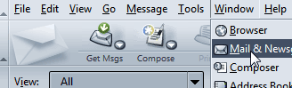
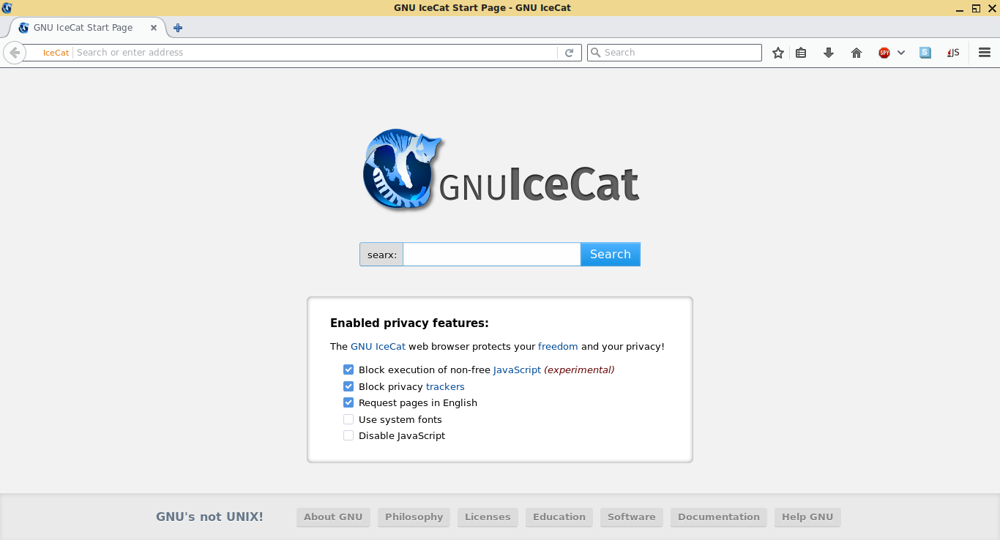

# Web browsers
Accessing [internet](https://en.wikipedia.org/wiki/Internet) can be done in several ways on computer/laptop, either using a fancy internet browser or a simple one in the terminal console.

What is a web browser? 
https://en.wikipedia.org/wiki/Web_browser

Comparison of web browsers 
https://en.wikipedia.org/wiki/Comparison_of_web_browsers

---

## SeaMonkey 

[SeaMonkey](https://en.wikipedia.org/wiki/SeaMonkey) is a browser having other apps integrated: e-mail and news client (Mail), HTML editor (Composer) and IRC client. It comes by default with _Modern_ and _Classic_ skins (themes), the [gorgeous Modern](https://www.freeemailtutorials.com/mozillaMail/mozillaMailThemes.php) reminding of [Netscape Navigator 6.1](https://en.wikipedia.org/wiki/Netscape_(web_browser)), the most appealing. Saddly, it was discontinued starting 2008-03-01. During the years it has different themes as shown on [Writework](https://www.writework.com/essay/web-browser-axia-college-university-phoenix-220-david-thomas) or [Everipedia](https://everipedia.org/wiki/lang_en/Netscape_(web_browser)). 
Links: [website](https://www.seamonkey-project.org/) | 
[repository/source-code](https://gitlab.com/seamonkey-project/seamonkey-2.53-mozilla) 
Windows/Linux/MacOS: 
[official download](https://www.seamonkey-project.org/releases/) 
[Old versions](https://www.seamonkey-project.org/releases/#old_unofficial)
Windows: 
[softpedia](https://www.softpedia.com/get/Internet/Browsers/SeaMonkey.shtml) | 
[filehippo](https://filehippo.com/download_seamonkey/) | 
chocolatey: not available 

## GNU IceCat 

[GNUzilla](https://handwiki.org/wiki/Software:Gnuzilla) is the [GNU version](https://en.wikipedia.org/wiki/GNU) of the [Mozilla Application Suite (discontinued)](https://en.wikipedia.org/wiki/Mozilla_Application_Suite), and [GNU IceCat](https://en.wikipedia.org/wiki/GNU_IceCat) is the [GNU version](https://en.wikipedia.org/wiki/GNU) of the [Firefox browser](https://en.wikipedia.org/wiki/Firefox). 
Note that building binary packages for Windows and MacOS currently requires nonfree software, so there is no binary package for those platforms. 
Links: [website](https://www.gnu.org/software/gnuzilla/) | 
[repository/source-code](https://git.savannah.gnu.org/cgit/gnuzilla.git) 
IRC: `#icecat` on [Libera.Chat](https://libera.chat/) 
Windows: 
[Unofficial builds for Windows x64](https://github.com/muslayev/icecat-win64) > [Releases](https://github.com/muslayev/icecat-win64/releases) | 
[chocolatey](https://community.chocolatey.org/packages/icecat) 
Linux: 
[official download (source)](https://ftp.gnu.org/gnu/gnuzilla/) | 
[GNU mirros](https://www.gnu.org/prep/ftp.html) | 
[RO mirror - HTTP](http://mirrors.nav.ro/gnu/icecat/) | 
[RO mirror - HTTPs](https://mirrors.nav.ro/gnu/icecat/) 
MacOS: no recent download 

## Pale Moon 
Firefox-based web browser that offers fast browsing speed while retaining a traditional user-friendly interface adopted by earlier versions of Firefox. Compatible with Windows and linux 
Links: [website](https://www.palemoon.org/) | 
[repository/source-code](https://repo.palemoon.org/) 
Windows: 
[official download](https://www.palemoon.org/download.shtml) | 
[softpedia](https://www.softpedia.com/get/Internet/Browsers/Pale-Moon.shtml) | 
[filehippo](https://filehippo.com/download_pale-moon/) | 
[chocolatey](https://community.chocolatey.org/packages/palemoon) 
Linux: 
[official download](https://linux.palemoon.org/) 

<!-- 
## _title_ 
_description_ 
Links: [website](#) | 
[repository/source-code](#) 
Windows: 
[official download](#) | 
[softpedia](#) | 
[filehippo](#) | 
[chocolatey](#) 
Linux: 
[official download]() 
MacOS: 
[official download]() 
-->
