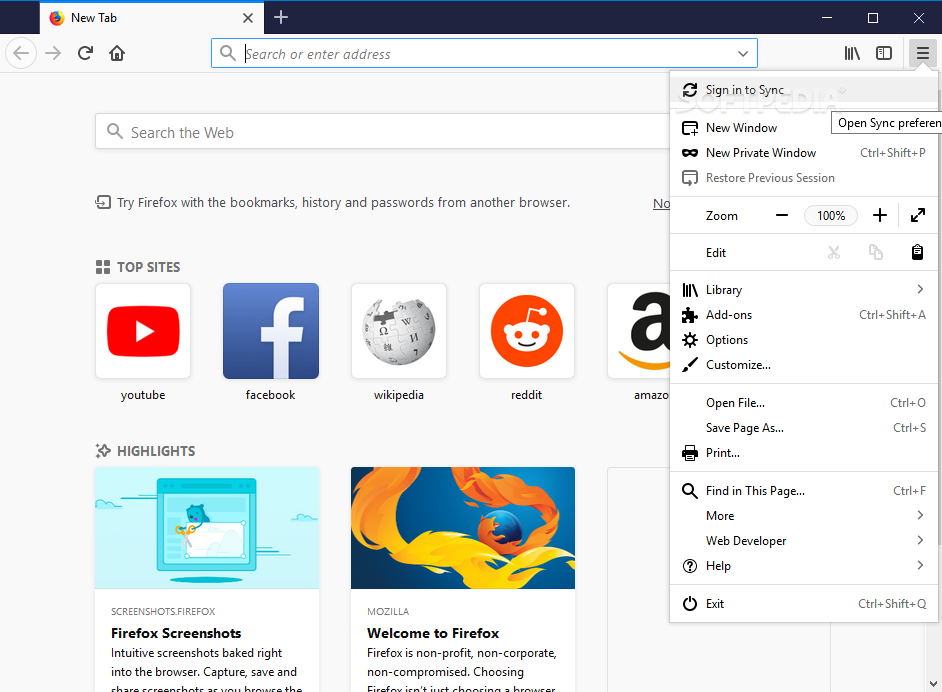
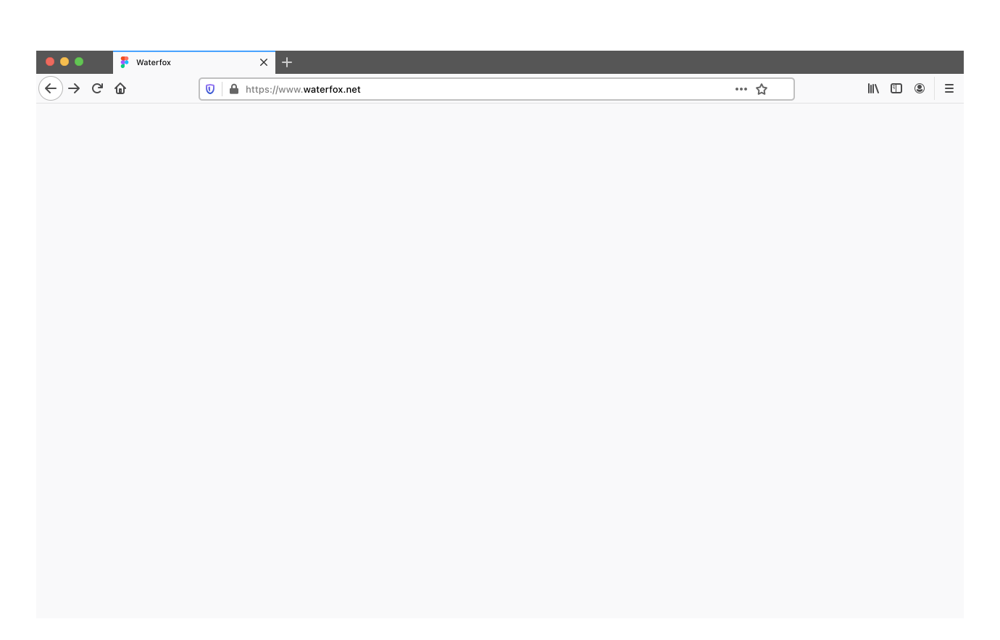

# Web browsers
Accessing the [internet](https://en.wikipedia.org/wiki/Internet) can be done in several ways on computer/laptop, either using a fancy internet browser or a simple one in the terminal console. Presented bellow are information from trusted sources.

What is a web browser? 
https://en.wikipedia.org/wiki/Web_browser

Comparison of web browsers 
https://en.wikipedia.org/wiki/Comparison_of_web_browsers

---

To be added: 

- [Chromium](https://www.chromium.org/Home/): [GitHub](https://github.com/chromium/chromium) / [source-code](https://chromium.googlesource.com/chromium/src/)

- ungoogled-chromium (Chromium fork): [github](https://github.com/Eloston/ungoogled-chromium) / [chocolatey](https://community.chocolatey.org/packages/ungoogled-chromium) / [softpedia](https://www.softpedia.com/get/Internet/Browsers/UnGoogled-Chromium.shtml)
- Torch Browser: [filehippo](https://filehippo.com/download_torch-browser/)

---

## Mozilla Firefox 

[Firefox](https://en.wikipedia.org/wiki/Firefox) is developed by the [Mozilla Foundation](https://en.wikipedia.org/wiki/Mozilla_Foundation) and its subsidiary, the [Mozilla Corporation](https://en.wikipedia.org/wiki/Mozilla_Corporation). The Mozilla Foundation offers a "bug bounty" (US$3,000 to US$7,500 cash reward) to researchers who discover severe security holes in Firefox. 

[Firefox ESR](https://www.mozilla.org/en-US/firefox/enterprise/) (Extended Support Release) is a version of Firefox for organizations and other groups that need extended support for mass deployments. Each ESR release, based on the regular version released at the same time, is supported for one year. Unlike the regular ("rapid") releases, ESRs are not updated with new features and performance enhancements every four weeks, but rather are updated with only high-risk-reduction or high-impact security fixes or major stability fixes with point releases, until the end of the ESR cycle.

Firefox developers builds [Tier-1 Targets](https://firefox-source-docs.mozilla.org/build/buildsystem/supported-configurations.html#tier-1-targets) (Android, Linux, macOS, and Windows) using [hosts such as](https://firefox-source-docs.mozilla.org/build/buildsystem/supported-configurations.html#build-hosts) Ubuntu x64, Debian x64, Fedora x64, macOS Intel & M1, Windows x64. Their supported compilers are _clang_ and _gcc_. There are dedicated pages for building on [Windows](https://firefox-source-docs.mozilla.org/setup/windows_build.html), [macOS](https://firefox-source-docs.mozilla.org/setup/macos_build.html) and [Linux](https://firefox-source-docs.mozilla.org/setup/linux_build.html).
Links: [website](https://www.mozilla.org/en-US/) | 
[repository/source-code](https://firefox-source-docs.mozilla.org/) 
Windows/Linux/MacOS: 
[official download](https://www.mozilla.org/en-US/firefox/all/) 
[Old versions](https://support.mozilla.org/en-US/kb/install-older-version-firefox?redirectslug=install-older-version-of-firefox&redirectlocale=en-US)
Windows: 
[softpedia](https://www.softpedia.com/get/Internet/Browsers/Mozilla-Firefox-Final.shtml) | 
[filehippo](https://filehippo.com/download_mozilla-firefox-64/) (looks old, need to check) | 
[chocolatey](https://community.chocolatey.org/packages/Firefox) 

---

## SeaMonkey 

[SeaMonkey](https://en.wikipedia.org/wiki/SeaMonkey) is a browser having other apps integrated: e-mail and news client (Mail), HTML editor (Composer) and IRC client. It comes by default with _Modern_ and _Classic_ skins (themes), the [gorgeous Modern](https://www.freeemailtutorials.com/mozillaMail/mozillaMailThemes.php) reminding of [Netscape Navigator 6.1](https://en.wikipedia.org/wiki/Netscape_(web_browser)), the most appealing. Saddly, it was discontinued starting 2008-03-01. During the years it has different themes as shown on [Writework](https://www.writework.com/essay/web-browser-axia-college-university-phoenix-220-david-thomas) or [Everipedia](https://everipedia.org/wiki/lang_en/Netscape_(web_browser)). 

Links: [website](https://www.seamonkey-project.org/) | 
[repository/source-code](https://gitlab.com/seamonkey-project/seamonkey-2.53-mozilla) 
Windows/Linux/MacOS: 
[official download](https://www.seamonkey-project.org/releases/) 
[Old versions](https://www.seamonkey-project.org/releases/#old_unofficial)
Windows: 
[softpedia](https://www.softpedia.com/get/Internet/Browsers/SeaMonkey.shtml) | 
[filehippo](https://filehippo.com/download_seamonkey/) | 
chocolatey: not available 

## GNU IceCat 

[GNUzilla](https://handwiki.org/wiki/Software:Gnuzilla) is the [GNU version](https://en.wikipedia.org/wiki/GNU) of the [Mozilla Application Suite (discontinued)](https://en.wikipedia.org/wiki/Mozilla_Application_Suite), and [GNU IceCat](https://en.wikipedia.org/wiki/GNU_IceCat) is the [GNU version](https://en.wikipedia.org/wiki/GNU) of the [Firefox browser](https://en.wikipedia.org/wiki/Firefox). 
Note that building binary packages for Windows and MacOS currently requires nonfree software, so there is no binary package for those platforms. 

Links: [website](https://www.gnu.org/software/gnuzilla/) | 
[repository/source-code](https://git.savannah.gnu.org/cgit/gnuzilla.git) 
IRC: `#icecat` on [Libera.Chat](https://libera.chat/) 
Windows: 
[Unofficial builds for Windows x64](https://github.com/muslayev/icecat-win64) > [Releases](https://github.com/muslayev/icecat-win64/releases) | 
[chocolatey](https://community.chocolatey.org/packages/icecat) 
Linux: 
[official download (source)](https://ftp.gnu.org/gnu/gnuzilla/) | 
[GNU mirros](https://www.gnu.org/prep/ftp.html) | 
[RO mirror - HTTP](http://mirrors.nav.ro/gnu/icecat/) | 
[RO mirror - HTTPs](https://mirrors.nav.ro/gnu/icecat/) 
MacOS: no recent download 

## Pale Moon 

Firefox-based web browser that offers fast browsing speed while retaining a traditional user-friendly interface adopted by earlier versions of Firefox. Compatible with Windows and linux. 

Links: [website](https://www.palemoon.org/) | 
[repository/source-code](https://repo.palemoon.org/) 
Windows: 
[official download](https://www.palemoon.org/download.shtml) | 
[softpedia](https://www.softpedia.com/get/Internet/Browsers/Pale-Moon.shtml) | 
[filehippo](https://filehippo.com/download_pale-moon/) | 
[chocolatey](https://community.chocolatey.org/packages/palemoon) 
Linux: 
[official download](https://linux.palemoon.org/) 

## Waterfox 

A fork of Firefox that was maintained by just one person (Alex Kontos) for many years and was playing nive with privacy: no telemetry, no data collection, very clean. Sadly, it has been [sold to System1](https://www.waterfox.net/blog/waterfox-has-joined-system1) ([alt1 link](https://www.ghacks.net/2020/02/14/waterfox-web-browser-sold-to-system1/), [alt2 link](https://old.reddit.com/r/privacy/comments/f3gqoc/privacy_browser_waterfox_appears_to_be_sold_to/)), the same company that [bought Startpage search engine](https://www.ghacks.net/2019/11/16/startpage-search-owner-changes-raise-serious-questions/). 
Note: [System1](https://system1.com/) is actually in the business of data collection 

Links: [website](https://www.waterfox.net/) | 
[repository/source-code](https://github.com/WaterfoxCo/Waterfox/) 
Windows/linux/MacOS: 
[official download](https://www.waterfox.net/download) | 
[GitHub](https://github.com/WaterfoxCo/Waterfox/releases/)  
Windows only: 
[softpedia](https://www.softpedia.com/get/Internet/Browsers/Waterfox.shtml) | 
[filehippo](https://filehippo.com/download_waterfox/) | 
[chocolatey](https://community.chocolatey.org/packages/waterfox) 

## Waterfox classic 

A legacy web browser for older systems and those that require use of [XPCOM](https://en.wikipedia.org/wiki/XPCOM) and [XUL](https://en.wikipedia.org/wiki/XUL) extensions. 
Note1: As of [2021-10-28](https://www.waterfox.net/blog/classic-update/) post, Waterfox Classic and Waterfox diverged into different scopes. 
Note2: Waterfox Classic has many unpatched [security advisories](https://github.com/WaterfoxCo/Waterfox-Classic/wiki/Unpatched-Security-Advisories), advising to be  used at user's discretion. 

Links: [website](https://classic.waterfox.net/) | 
[repository/source-code](https://github.com/WaterfoxCo/Waterfox-Classic) 
Windows: 
[softpedia](https://www.softpedia.com/get/Internet/Browsers/Waterfox.shtml) | 
filehippo: not available | 
[chocolatey](https://community.chocolatey.org/packages/waterfox-classic) 

## Brave 

A Chromium-based browser often recommended for privacy. It can browse Dark web (Tor network) via Brave Tor node ([how-to](https://restoreprivacy.com/how-to-access-dark-web-safely/)). It's recommended having a VPN as well. 

Links: [website](https://brave.com/) | 
[repository/source-code](https://github.com/brave/brave-browser) 
Windows/linux/MacOS:
[official download](https://brave.com/download/) 
Windows: 
[official download](https://laptop-updates.brave.com/latest/winx64) | 
[softpedia](https://www.softpedia.com/get/Internet/Browsers/Brave.shtml) | 
[filehippo](https://filehippo.com/download_brave-browser/) | 
[chocolatey](https://community.chocolatey.org/packages/brave/1.34.81) 
Linux: 
[official download](https://brave.com/linux/#release-channel-installation) 
MacOS: 
[official download](https://laptop-updates.brave.com/latest/osx) 

---

## Reference links
Top 10 Secure Browsers That Protect Your Privacy in 2022: Brave, Firefox, Tor browser, Ungoogled Chromium, Waterfox, Pale Moon, GNU IceCat, Iridium 
https://restoreprivacy.com/browser/secure/ 
Some browsers are secure, but privacy at risk: Google Chrome, Microsoft Edge, Opera, Epic, Safari, Vivaldi. 
Some browsers mentioned in comments: LibreWolf, Ghostery Dawn, Vivaldi 

Browser Fingerprinting Protection 
https://restoreprivacy.com/browser-fingerprinting/ 

WebRTC Leaks 
https://restoreprivacy.com/webrtc-leaks/ 
Note: WebRTC cannot be disabled in Chrome (desktop) 

<!-- 
## _title_ 

_description_ 

Links: [website](#) | 
[repository/source-code](#) 
Windows/linux/MacOS:
[official download](#) 
Windows: 
[official download](#) | 
[softpedia](#) | 
[filehippo](#) | 
[chocolatey](#) 
Linux: 
[official download]() 
MacOS: 
[official download]() 
-->
